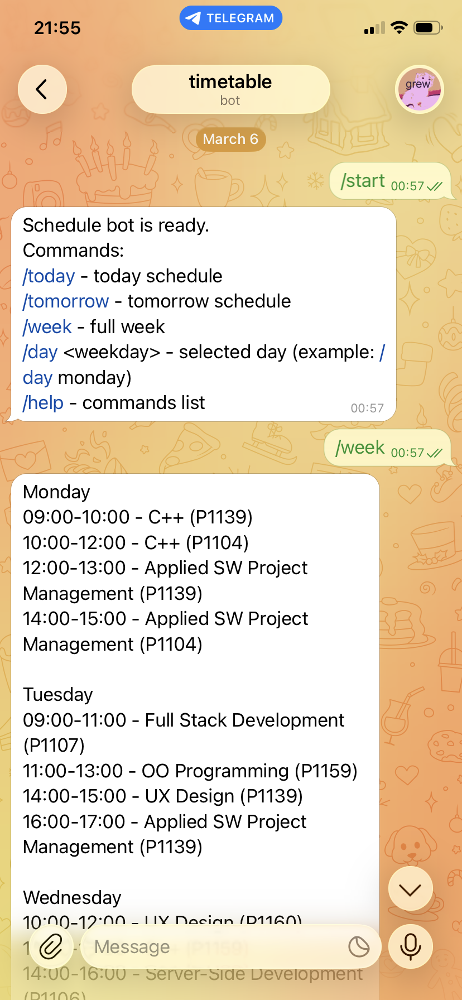

# Telegram Schedule Bot

Simple Telegram bot to view your class schedule from `schedule.json`.



## Features

- `/today` shows today's schedule
- `/tomorrow` shows tomorrow's schedule
- `/week` shows the full week schedule
- `/day <weekday>` shows a selected day (`monday` ... `sunday`)

## Requirements

- Python 3.10+
- Telegram bot token from [@BotFather](https://t.me/BotFather)

## Setup

1. Install dependencies:

```bash
pip install -r requirements.txt
```

2. Set bot token:

```bash
export TELEGRAM_BOT_TOKEN="YOUR_TOKEN_HERE"
```

3. Run the bot:

```bash
python bot.py
```

## Configure Schedule

Edit `schedule.json` and update `days` entries.

Each lesson item supports:

- `time`
- `subject`
- `location`
- `teacher` (optional)

Example:

```json
{
  "time": "09:00",
  "subject": "Mathematics",
  "location": "Room 101"
}
```
